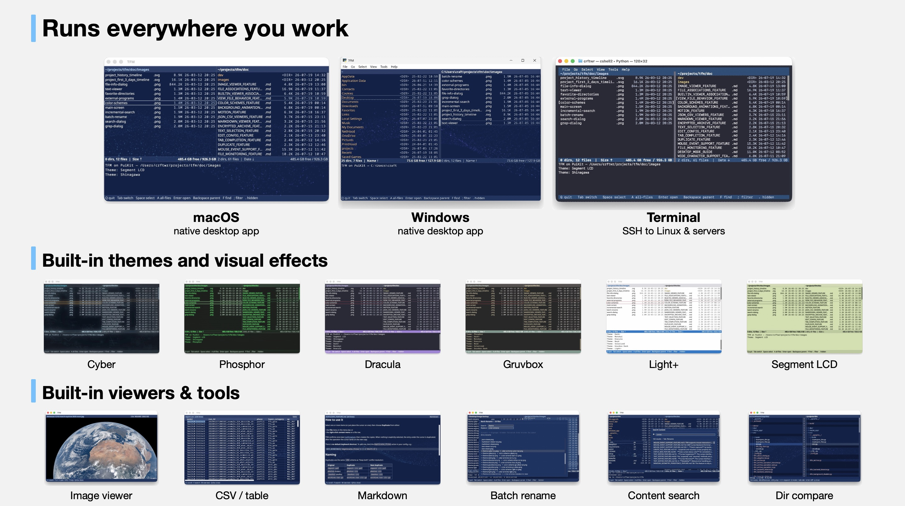

# XeFM — a dual-pane file manager for the desktop and the terminal

XeFM — short for *Xenolith File Manager* — is a powerful file manager that runs as a native desktop application on **Windows and macOS**, and in the terminal on **all platforms — Windows, macOS, and Linux**. Navigate your filesystem with keyboard shortcuts in a clean, intuitive dual-pane interface with comprehensive file operations, rich built-in viewers, themeable visual effects, and professional-grade features.



## Key Features

- **Cross-platform** - Native desktop app on **Windows and macOS**; terminal (TUI) app on **Windows, macOS, and Linux**
- **Dual-pane interface** with independent navigation and cross-pane operations
- **Archive browsing** - Navigate ZIP, TAR, and compressed archives as virtual directories
- **SFTP support** - Browse and manage remote servers via SSH with optimized performance
- **AWS S3 support** for cloud storage operations
- **Advanced search** with real-time filtering, background processing, and multi-selection bulk operations
- **Rich built-in viewers** - Syntax-highlighted text, images, Markdown, JSON, and CSV/TSV
- **Themes & visual effects** - A dozen built-in themes; desktop mode adds GPU background animations, CRT/phosphor screen effects, and text-reveal animations
- **Customizable** - Fully configurable key bindings, settings, and external program launchers

## Quick Start

### Installation

Pick the install that matches how you want to run XeFM:

| | Get it from | Gives you |
|---|---|---|
| **Desktop app** — Windows | the **[Microsoft Store](https://apps.microsoft.com/detail/9PK2X44W810V)** | A real installed application, signed by Microsoft: one click, automatic updates, no SmartScreen prompt. No Python needed. |
| **Desktop app** — macOS | the [latest release](https://github.com/crftwr/xefm/releases/latest) | A real installed application: own icon, Dock entry, own file permissions. No Python needed. |
| **Terminal app** — Windows, macOS, Linux | [PyPI](https://pypi.org/project/xefm/) | The `xefm` command in any terminal, including over SSH. Needs Python 3.10+. |

The desktop and terminal apps coexist and share their settings in `~/.xefm/` —
installing both is a perfectly normal setup.

### Desktop app (Windows, macOS)

The desktop packages bundle their own Python, so there is nothing else to install.

**Windows** — install from the
**[Microsoft Store](https://apps.microsoft.com/detail/9PK2X44W810V)**, or run
`winget install --id 9PK2X44W810V --source msstore`: XeFM lands in the Start
menu, updates automatically, and uninstalls from *Settings → Apps*. An unsigned
**portable zip** also ships with every
[release](https://github.com/crftwr/xefm/releases/latest); it needs
[unblocking once](doc/DESKTOP_MODE_GUIDE.md#windows--the-portable-zip).

**macOS** — download `XeFM-<version>-macos.dmg` from the
**[latest release](https://github.com/crftwr/xefm/releases/latest)**, drag
**XeFM** to *Applications*, and launch it from Launchpad or Spotlight. It is
signed with the author's Apple Developer ID; full install details, including
Gatekeeper notes, are in the
**[Desktop Mode Guide](doc/DESKTOP_MODE_GUIDE.md#installing-the-desktop-app-package)**.

> **Use the package, not `xefm --backend gui`** — that path is for developing
> XeFM, not for using it: the Dock / taskbar icon and, on macOS, the file
> permissions get attributed to Python / your terminal instead of to XeFM. See
> [Why not `xefm --backend gui`?](doc/DESKTOP_MODE_GUIDE.md#why-not-xefm---backend-gui).

### Terminal app (Windows, macOS, Linux)

XeFM is on [PyPI](https://pypi.org/project/xefm/). Install it as a tool and run
it — no checkout and no virtualenv to manage:

```bash
pipx install xefm     # or:  uv tool install xefm,  or:  pip install xefm
xefm
```

[pipx](https://pipx.pypa.io) and [uv](https://docs.astral.sh/uv/) keep XeFM in
its own environment while putting the `xefm` command on your PATH; `uvx xefm`
tries it once without installing anything. Python 3.10+ is the only
prerequisite, and this is the only install available on Linux — the one for
SSH sessions, remote servers, and terminal-centric workflows.

**Upgrade with the same tool you installed with** (`pipx upgrade xefm`,
`uv tool upgrade xefm`, or `pip install --upgrade xefm`) — they are not
interchangeable. Details and fixes for common install errors are in the
[User Guide](doc/XEFM_USER_GUIDE.md#upgrading-and-uninstalling).

### From source

Working on XeFM itself? Use a checkout instead:

```bash
git clone https://github.com/crftwr/xefm.git
cd xefm
make venv        # creates .venv with every dependency
make run         # launch XeFM through it, no activation needed
```

`make help` lists the rest — editable install, PuiKit co-development, and the
macOS / Windows app bundles.

### Essential Controls

- **Navigate:** `↑↓` to move up/down, `←→` to switch panes/navigate directories
- **Select:** `Space` to select/deselect files, `A` for all files, `Shift-A` for all items
- **File operations:** `C` (copy), `M` (move), `K` (delete), `R` (rename)
- **Search:** `F` for incremental search, `Shift-F` for filename search, `Shift-G` for content search
- **Remote paths:** open `ssh://hostname/path` or `s3://bucket/path` like any directory
- **Help:** `?` opens the help dialog with every key binding organized by category — no need to memorize
- **Quit:** `Q` to exit

## Documentation

### User Documentation
- **[Complete User Guide](doc/XEFM_USER_GUIDE.md)** - Comprehensive guide covering all features, configuration, and usage
- **[Configuration](doc/CONFIGURATION_FEATURE.md)** - Complete configuration reference and customization guide
- **[Desktop Mode](doc/DESKTOP_MODE_GUIDE.md)** - Native Windows / macOS desktop app setup and options
- **[Color Schemes & Visual Effects](doc/COLOR_SCHEMES_FEATURE.md)** - Themes, themeable GPU background scenes, and screen effects
- **[Image Viewer](doc/IMAGE_VIEWER_FEATURE.md)**, **[Markdown Viewer](doc/MARKDOWN_VIEWER_FEATURE.md)** & **[JSON / CSV Viewers](doc/JSON_CSV_VIEWERS_FEATURE.md)** - Built-in viewers
- **[Diff Viewer](doc/DIFF_VIEWER_FEATURE.md)** & **[Batch Rename](doc/BATCH_RENAME_FEATURE.md)** - File / directory diffs and regex-based multi-file renaming
- **[SFTP Support](doc/SFTP_SUPPORT_FEATURE.md)** - Remote server access via SSH with file operations and search
- **[AWS S3 Support](doc/S3_SUPPORT_FEATURE.md)** - Cloud storage integration and S3 bucket management
- **[Archives](doc/ARCHIVE_FEATURE.md)** - Create, extract, and browse archives as directories
- **[Search Animation](doc/SEARCH_ANIMATION_FEATURE.md)** - Advanced search features and visual feedback

### Developer Documentation
- **[Project Structure](doc/dev/PROJECT_STRUCTURE.md)** - Repository layout and where things live
- **[Path Polymorphism System](doc/dev/PATH_POLYMORPHISM_SYSTEM.md)** - Storage-agnostic architecture and extensibility
- **[Navigation System](doc/dev/NAVIGATION_SYSTEM.md)** - Core navigation implementation
- **[External Programs](doc/dev/EXTERNAL_PROGRAMS_SYSTEM.md)** - Program integration system

## Archive Virtual Directory Browsing

Press `Enter` on an archive file (`.zip`, `.tar`, `.tar.gz`, `.tgz`, `.tar.bz2`,
`.tar.xz`) to browse it as if it were a regular directory — no extraction
needed. Navigate nested directories, view files, search by name or content, and
copy files out with the normal copy key; `Backspace` leaves the archive. `P`
creates a new archive, `U` extracts one. See the
[Archive Feature Guide](doc/ARCHIVE_FEATURE.md).

## Built-in File Viewers

Press `V` (or `Enter`) to view the selected file. XeFM picks the right viewer
for the file type: syntax-highlighted text (20+ formats, line numbers, wrapping,
in-file search), images with zoom / pan (inline in iTerm2 / kitty / sixel
terminals and in desktop mode), and *rendered* views for Markdown, JSON, and
CSV/TSV (`M` toggles rendered / raw). All viewers work on local files, inside
archives, and on remote SFTP / S3 paths without extraction or download.


| Markdown | JSON / JSONL | CSV / TSV |
|:---:|:---:|:---:|
|  |  |  |
| Rendered headings, lists, code, and links | Collapsible, syntax-colored tree (`.json`, `.jsonl`, `.ndjson`) | Column-aligned table grid (`.csv`, `.tsv`) |


## Themes & Visual Effects

XeFM ships a dozen built-in themes. Press `T` to cycle to the next theme, or pick one from the **View → Theme** menu — your choice is remembered across restarts. Define your own in `~/.xefm/config.py` and they appear in the picker alongside the built-ins.

| | | |
|:---:|:---:|:---:|
| <br>**Dark+** | <br>**Monokai** | <br>**Dracula** |
| <br>**Nord** | <br>**Solarized** | <br>**Gruvbox Dark** |
| <br>**Light+** | <br>**Solarized Light** | <br>**Sci-Fi** |
| <br>**Cyber** | <br>**Segment LCD** | <br>**Shinagawa** |

In desktop mode a theme can also carry **visual effects** the GPU renders behind
and over the interface: background animations (`starfield`, `rain`, `hologram`,
…), CRT / phosphor screen post-effects, text-reveal animations, and translucent
surfaces. Effects are pure theme data — a custom theme can mix and match them,
and terminal mode ignores them. See
[Color Schemes & Visual Effects](doc/COLOR_SCHEMES_FEATURE.md).

## Sub-shell Mode

Press `Shift-X` to temporarily suspend XeFM and enter a shell whose environment
describes the current panes and selection (`XEFM_LEFT_DIR`, `XEFM_THIS_DIR`,
`XEFM_LEFT_SELECTED`, …); type `exit` to return to XeFM. The full variable list
is in the [User Guide](doc/XEFM_USER_GUIDE.md#sub-shell-mode).

## Command Line Options

These apply to the terminal install and to source checkouts (where every command
also works as `python3 -m xefm …`); the desktop packages take no arguments.

```bash
xefm                                    # terminal mode (the default)
xefm --left /path/a --right /path/b     # startup directories
xefm --backend gui                      # desktop window — development path only
```

The full flag set is `--backend {tui,curses,gui,macos,windows}`, `--left DIR`,
`--right DIR`, `--version`, and `--help`. Backend details are in the
[Desktop Mode Guide](doc/DESKTOP_MODE_GUIDE.md#choosing-the-backend).

## Configuration

XeFM is highly configurable through `~/.xefm/config.py` — themes and visual
effects, key bindings, external programs and file associations, favorite
directories, and behavior settings. Open the settings menu with `Shift-Z`
(`Z` opens view options), or edit the file directly. See the
**[Configuration Feature Guide](doc/CONFIGURATION_FEATURE.md)**.

## Troubleshooting

- *"Windows protected your PC"* when launching the portable `XeFM.exe` — the zip is not code-signed; click **More info** → **Run anyway**, or [unblock the zip](doc/DESKTOP_MODE_GUIDE.md#windows--the-portable-zip) before extracting. The [Microsoft Store](https://apps.microsoft.com/detail/9PK2X44W810V) install is signed and never shows this prompt
- *"XeFM cannot be opened because the developer cannot be verified"* on macOS — right-click `XeFM.app` in *Applications* and choose **Open**, then confirm once
- Install problems (`command not found`, `externally-managed-environment`, upgrade errors) — see [Installation troubleshooting](doc/XEFM_USER_GUIDE.md#installation-troubleshooting)

More in the [User Guide](doc/XEFM_USER_GUIDE.md#troubleshooting) and the [Desktop Mode Guide](doc/DESKTOP_MODE_GUIDE.md#troubleshooting).

## Contact & Support

- **GitHub Issues**: [Report bugs or request features](https://github.com/crftwr/xefm/issues)
- **Microsoft Store**: [XeFM on the Store](https://apps.microsoft.com/detail/9PK2X44W810V) — the Windows desktop app
- **PyPI**: [pypi.org/project/xefm](https://pypi.org/project/xefm/) — released versions (`pipx install xefm`)
- **Author's X (Twitter)**: [@crftwr](https://x.com/crftwr)

## License

MIT License - see [LICENSE](LICENSE) file for details.
