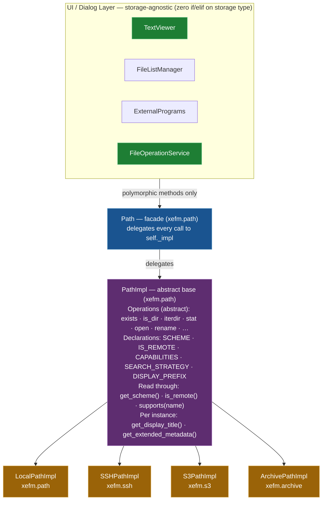

# Path Polymorphism System

## Overview

The Path Polymorphism System is XeFM's core abstraction layer that enables storage-agnostic code throughout the application. By extending the `PathImpl` interface with strategic virtual methods, the system eliminates all storage-specific conditionals from UI and dialog code, making it trivial to add new storage types without modifying existing code.

## Architecture

### Component Hierarchy



### Design Principles

1. **Open/Closed Principle**: Open for extension (new storage types), closed for modification (UI code)
2. **Dependency Inversion**: UI depends on abstractions (PathImpl), not concrete implementations
3. **Single Responsibility**: Each PathImpl subclass handles only its storage type
4. **Polymorphism Over Conditionals**: Behavior varies through method overriding, not if/else checks

## Path Facade and Migration History

### The Facade / Implementation Split

The polymorphism system is built on a three-layer split in `xefm/path.py`:

- **`PathImpl` (abstract base)** — defines the full `pathlib.Path`-compatible
  interface (`exists`, `is_dir`, `is_file`, `iterdir`, `stat`, …) plus the
  strategic virtual methods documented below. Instantiating it directly raises
  `TypeError`.
- **`LocalPathImpl` (concrete)** — implements `PathImpl` for the local filesystem
  by wrapping a `pathlib.Path`, so local operations have no overhead and behave
  identically to stock `pathlib`.
- **`Path` (facade)** — the public class every module imports. It holds a single
  `self._impl` and delegates every call to it. `Path.__init__` selects the
  implementation via **`Path._create_implementation(path_str)`**, which dispatches
  by URI scheme.

`_create_implementation` is the real entry point for backend selection (there is
no `Path()`): it returns an `ArchivePathImpl`, `S3PathImpl`, or
`SSHPathImpl` for the matching scheme, and falls back to `LocalPathImpl` for
ordinary paths. `Path.__init__` also keeps the raw URI intact (instead of running
it through `PathlibPath`) for any registered remote scheme.

### pathlib Compatibility

The facade preserves 100% compatibility with `pathlib.Path`:

- **Import swap only** — modules migrated from `from pathlib import Path` to
  `from xefm.path import Path`; call sites were left unchanged.
- **Same behavior and performance** — local paths delegate straight to `pathlib.Path`.
- **Zero breaking changes** — existing local-path code kept working through the migration.

### Migration History

XeFM originally used `pathlib.Path` directly throughout `src/`. To make room for
non-local storage without rewriting call sites, the codebase was migrated to the
`Path` facade above. All `src/` modules that touch paths were switched to
`from xefm.path import Path` — including `xefm/app.py`, `xefm/file_operations.py`,
`xefm/pane_manager.py`, `xefm/state_manager.py`, `xefm/config.py`,
`xefm/text_viewer.py`, and the various dialog modules.

What early design notes framed as "future remote storage" now **exists**: the
archive (`xefm.archive.ArchivePathImpl`), S3 (`xefm.s3.S3PathImpl`), and SSH/SFTP
(`xefm.ssh.SSHPathImpl`) backends are all implemented and selected automatically by
`_create_implementation`. Additional schemes (FTP, WebDAV, etc.) can be added the
same way — see "Adding New Storage Types" below.

## What a Backend Does, and What a Backend Is

`PathImpl` splits in two. The **operations** — `exists`, `is_dir`, `iterdir`,
`stat`, `open`, `rename`, … — stay abstract: they are code, and only the backend
can write them. What a backend *is* — its scheme, whether it is remote, what it
can be asked to do, how its content is best searched — is not code. For every
backend XeFM ships it is a compile-time constant, so it is declared rather than
implemented.

### The Five Declarations

```python
class S3PathImpl(PathImpl):
    SCHEME = 's3'
    IS_REMOTE = True
    CAPABILITIES = frozenset({'write_operations', 'extraction_for_reading',
                              'cache_for_search'})
    SEARCH_STRATEGY = 'buffered'
    DISPLAY_PREFIX = 'S3: '
```

| attribute | type | read through | default |
|---|---|---|---|
| `SCHEME` | `str` | `get_scheme()` | `''` — every concrete backend must set it |
| `IS_REMOTE` | `bool` | `is_remote()` | `False` |
| `CAPABILITIES` | set of names | `supports(name)` | empty — nothing is assumed |
| `SEARCH_STRATEGY` | `'streaming'` / `'buffered'` / `'extracted'` | the attribute | `'buffered'` |
| `DISPLAY_PREFIX` | `str`, with trailing space | the attribute | `''` |

`KNOWN_CAPABILITIES` in `xefm/path.py` is the vocabulary:

| name | means |
|---|---|
| `write_operations` | copy, move, create, delete |
| `directory_rename` | renaming a directory, not just a file |
| `file_editing` | handing the file to an external editor |
| `streaming_read` | readable line by line, without a full fetch |
| `extraction_for_reading` | content must be fetched or extracted first |
| `cache_for_search` | that fetch is expensive enough to keep |

### As Shipped

| | Local | S3 | SSH | Archive |
|---|---|---|---|---|
| `SCHEME` | `file` | `s3` | `ssh` | `archive` |
| `IS_REMOTE` | False | True | True | *per path* |
| `write_operations` | ● | ● | ● | |
| `directory_rename` | ● | | ● | |
| `file_editing` | ● | | | |
| `streaming_read` | ● | | | |
| `extraction_for_reading` | | ● | ● | ● |
| `cache_for_search` | | ● | ● | ● |
| `SEARCH_STRATEGY` | `streaming` | `buffered` | `buffered` | `extracted` |
| `DISPLAY_PREFIX` | `''` | `'S3: '` | `'SSH: '` | `'ARCHIVE: '` |

`ArchivePathImpl.is_remote()` is the one entry in this table that is still a
method. An archive's remoteness is its container's: `archive://` over a file on
disk is local, the same URI over an object in S3 is not. It overrides the
method and ignores `IS_REMOTE`; that is what the method is for.

### Why Declarations and Not Methods

Before #426 each of these was an `@abstractmethod` that every backend answered
with a one-line `return`. Twelve of them, four backends — and **ten of the
twelve had no caller anywhere in the application**. One abstract declaration,
four implementations, one façade delegation, a handful of tests, and nothing
that read the answer. Publishing that interface would have meant asking an
outside implementer ten questions and discarding every answer.

Three things follow from declaring them instead:

- **An implementer answers in one line, or not at all.** A backend that
  declares nothing gets the conservative reading: read-only, unstreamable,
  uneditable. Never a capability it did not claim.
- **The vocabulary can grow.** Adding a name to `KNOWN_CAPABILITIES` cannot
  break a class written before it, because that class simply does not declare
  it. A new `@abstractmethod` would break every such class at *import* — which
  is exactly the hazard that keeps `PathImpl` itself from being a published
  extension point.
- **A capability nobody asked about is `False`, not an `AttributeError`.**
  `supports()` takes a string, so a caller written against a later XeFM asking
  `supports('time_travel')` here gets a plain `False`.

### Reading Them Back

```python
path.get_scheme()                    # 's3'
path.is_remote()                     # True
path.supports('write_operations')    # True
path.supports('directory_rename')    # False
path._impl.SEARCH_STRATEGY           # 'buffered'
path._impl.DISPLAY_PREFIX            # 'S3: '
```

`Path` delegates `get_scheme`, `is_remote` and `supports`; those have callers.
`SEARCH_STRATEGY` and `DISPLAY_PREFIX` are read off the implementation class,
and deliberately have no façade accessor: adding one is a two-line change for
whoever finds the first real caller, and until then the codebase does not carry
a method that nothing calls. The eight façade methods this replaced
(`supports_directory_rename`, `supports_file_editing`,
`supports_write_operations`, `requires_extraction_for_reading`,
`supports_streaming_read`, `should_cache_for_search`, `get_search_strategy`,
`get_display_prefix`) are gone; `test/test_path_capabilities.py` fails if one
comes back.

### The Two That Stayed Methods

`get_display_title()` and `get_extended_metadata()` compute something per
instance, so they remain methods — but they are **no longer abstract**. Their
defaults are `str(self)` and `{'type': SCHEME, 'details': [], 'format_hint':
'standard'}`, which is what every shipped backend except `LocalPathImpl` was
already returning by hand. An outside implementation overrides them if it has
something to show, and is not asked a question otherwise.

## Adding a New Storage Type

Subclass `PathImpl`, declare the five attributes, implement the operations, and
return the class from `Path._create_implementation` for its scheme.

```python
class CustomPathImpl(PathImpl):
    """A backend for custom://resource/path."""

    SCHEME = 'custom'
    IS_REMOTE = True
    CAPABILITIES = frozenset({'extraction_for_reading', 'cache_for_search'})
    SEARCH_STRATEGY = 'buffered'
    DISPLAY_PREFIX = 'CUSTOM: '

    def __init__(self, uri: str):
        self._uri = uri
        # parse the URI here; the contract is "URI string in, PathImpl out"

    # … then the abstract operations: __str__, __eq__, __hash__, __lt__,
    # name/stem/suffix/parent/parts, exists, is_dir, iterdir, stat, open, …
```

`PathImpl` is a strict ABC on purpose: every operation stays abstract so that a
backend inside this repository which forgets one fails at import, not in a
pane. That same strictness is why `PathImpl` is not a class to hand to code
outside this repository: a method added to it later would break every external
subclass at import.

The one thing the ABC cannot check is a *declaration*: a class attribute left
at its default is not a missing method. `test/test_path_capabilities.py`
carries that check instead — it fails when a shipped backend leaves `SCHEME`
empty, and it holds the matrix above so a change to any row has to be a change
to the table too.

## Validation

`PathImpl.__init_subclass__` checks the declarations as each subclass is
defined, and **warns and ignores** rather than raising — the same treatment
`EVENT_HOOKS` gives an unknown event name:

- a capability name outside `KNOWN_CAPABILITIES` is dropped, with a warning
  naming it and listing the known names;
- a `SEARCH_STRATEGY` outside `SEARCH_STRATEGIES` falls back to `'buffered'`,
  with a warning;
- `CAPABILITIES` is normalised to a `frozenset`, so a config may write a plain
  `{'streaming_read'}`.

Warn-and-ignore is the direction of compatibility that matters here: a backend
written against a *later* XeFM keeps the names this version understands and
loses only the one it could not have acted on anyway.

## Testing

`test/test_path_capabilities.py` holds the matrix, the validation rules, and
the list of retired methods. `test/test_mock_storage_extensibility.py` proves
the UI needs no change for a new backend by writing one.

## References

- `xefm/path.py` — `PathImpl`, `LocalPathImpl`, `Path`, `KNOWN_CAPABILITIES`
- `xefm/s3.py`, `xefm/ssh.py`, `xefm/archive.py` — the three remote backends
- `doc/dev/S3_SUPPORT_SYSTEM.md`, `doc/dev/SSH_SYSTEM.md`,
  `doc/dev/ARCHIVE_SYSTEM.md` — per-backend detail
- Discussion #426 — why the capability group became a declaration
